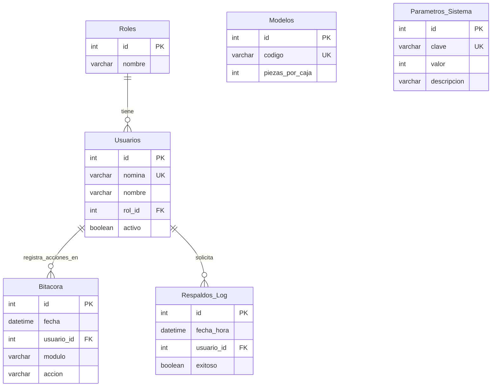

# Diagrama de Base de Datos - Nova Sound 🔊

Este repositorio centraliza el diseño de la base de datos de Nova Sound. Cada área debe agregar sus tablas a este diagrama para poder visualizar las conexiones globales del sistema.

### ¿Por qué usar este archivo en GitHub?
Al escribir nuestro diagrama usando el formato **Mermaid**, GitHub dibujará automáticamente el diagrama visual aquí abajo. Así, nadie tiene que estar dibujando y arrastrando cajitas a mano; el código se encarga de todo.

---

## Diagrama Global (Preview)

> **Instrucciones para el equipo:** Solo agreguen sus tablas y relaciones en el bloque de código de abajo. Cuando hagan `commit`, GitHub actualizará el dibujo al instante.

